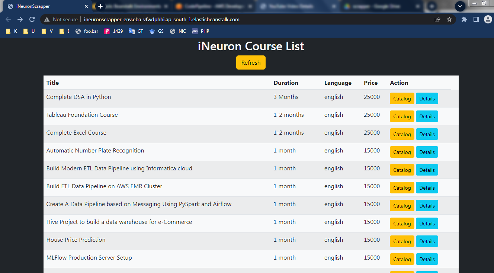
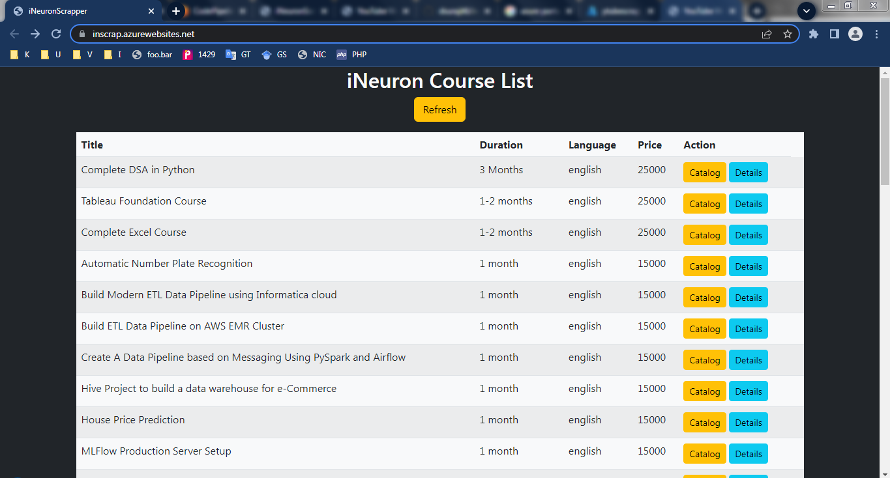
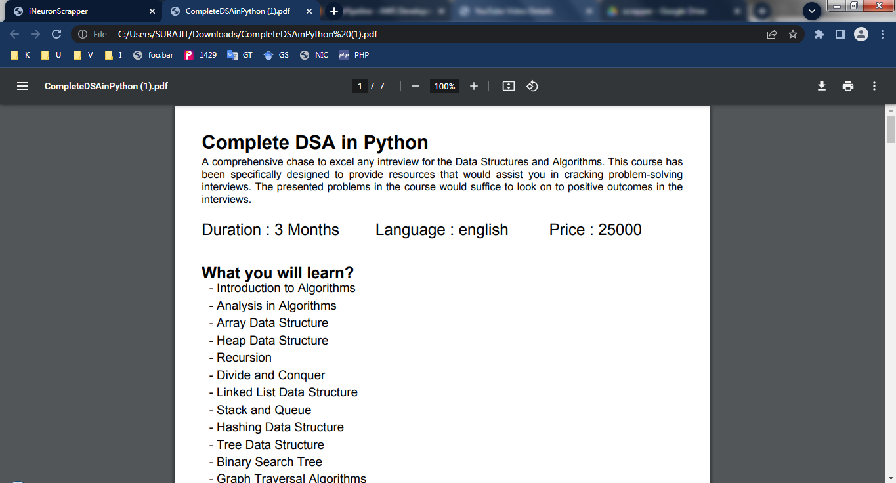
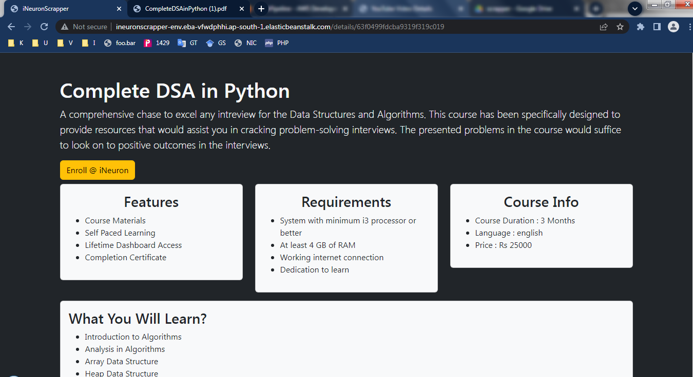
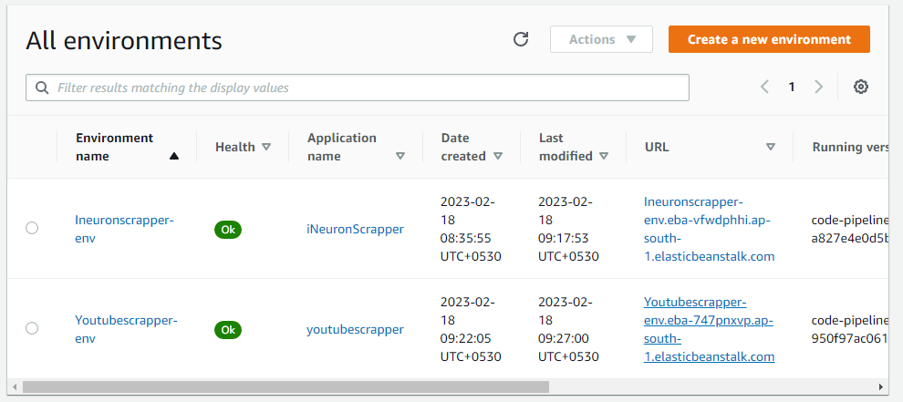
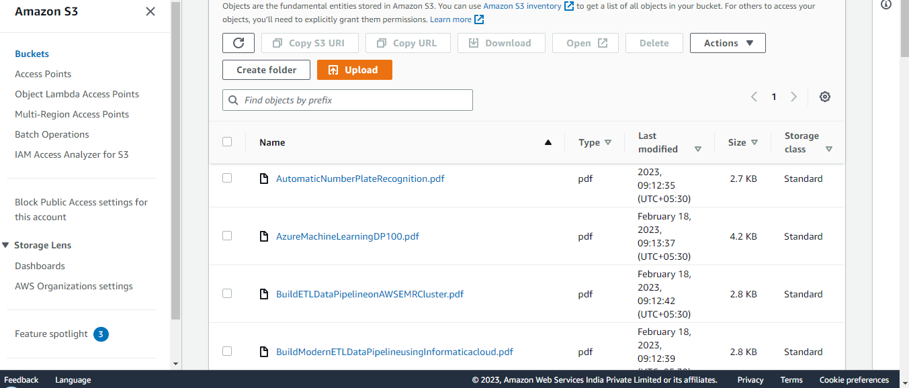
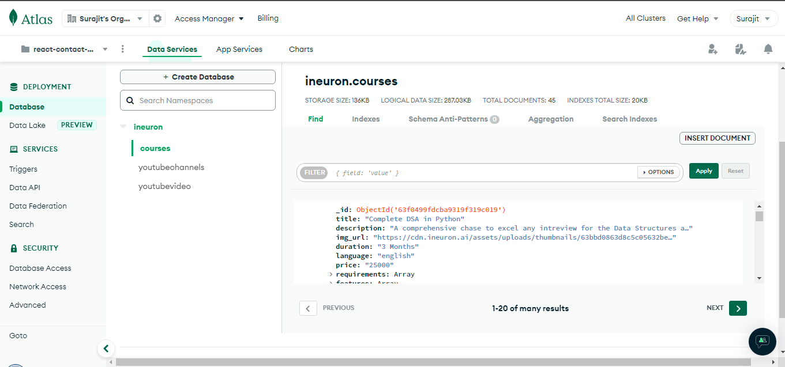

# iNeuron Course Details Scrapper
1. AWS screenshot
    
    - Refresh Button is to perfom the (re)scrapping operation. Previosly scrapped data is loaded.
        - Scrap the course details
        - Cretate PDF and store it to S3
        - Save Details to MongoDB
    - Catalog is to download the PDF from S3
    - Details is to view the couse Details
2. Azure screenshot
    
3. PDF Preview After download 
    
4. Course Details Page
    
5. Deployed Environment on AWS
    
6. S3 Bucket (PDF file storage)
    
7. MongoDB Collection
    
